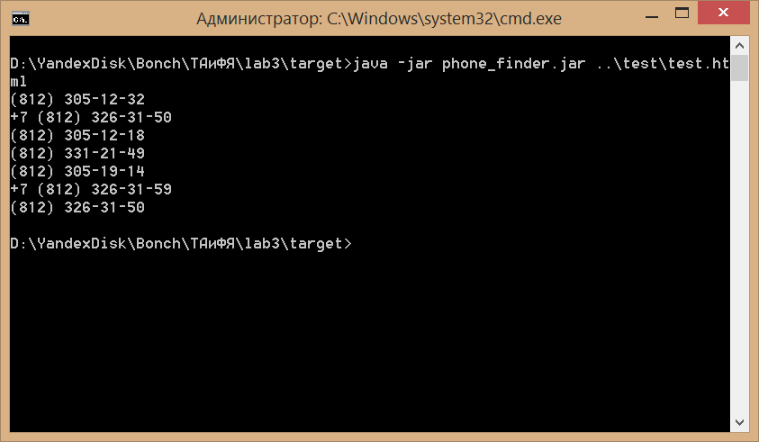

# ТАиФЯ
## Лабораторная работа №3: Регулярные выражения
### Запуск
- Убедитесь, что у вас установлен JRE 8
- Выполните из каталога target `java -jar phone_finder.jar <filename>`, 
где filename - имя файла, в котором нужно выполнить поиск номеров телефона. 
(Для теста выполните `java -jar phone_finder.jar ..\test\test.html`)

Снимок теста приложения:

